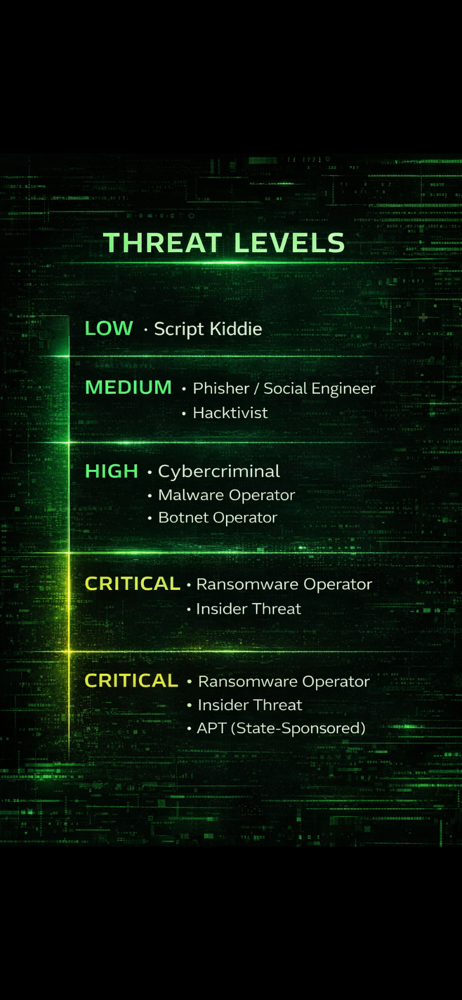
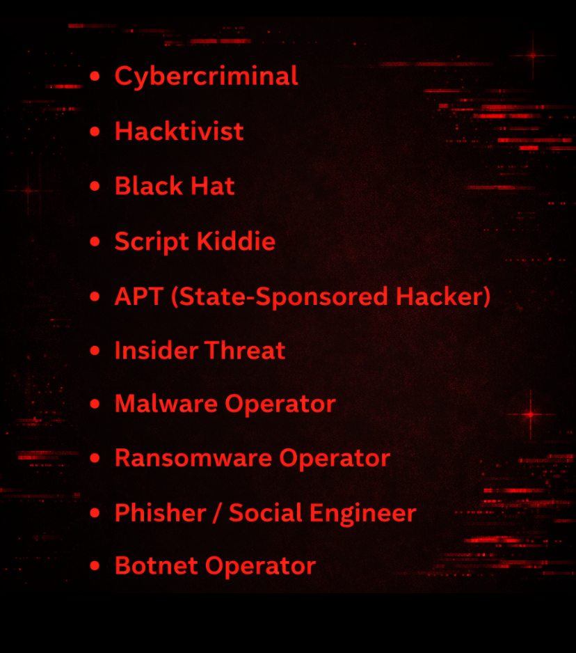
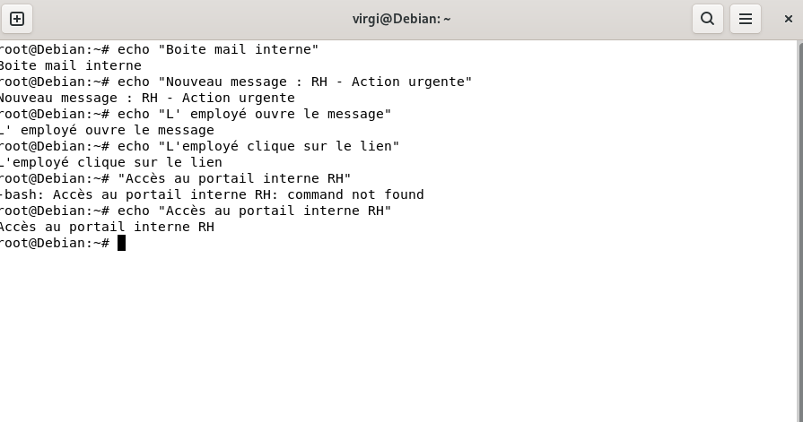

  

<h1 align="center">
  Profils d'attaquants & niveaux de menace 
  (Threat Actors)
</h1>

  © 2026 <strong>Virginie Lechene</strong> - Tous droits réservés 
  Reproduction interdite sans autorisation préalable. 
  Usage pédagogique uniquement.

  

---

Ce chapitre présente une **classification des profils d’attaquants** couramment rencontrés en cybersécurité, ainsi qu’une **estimation de leur niveau de menace**.

L’objectif est de **mieux comprendre les comportements, motivations et capacités** des différents acteurs malveillants, afin d’adapter les stratégies de défense et de prévention.

---

## 📑 Sommaire

- [Objectif du projet](#objectif-du-projet)
- [Profils de menace](#profils-de-menace)
  - [Niveau faible – Low Threat](#niveau-faible--low-threat)
  - [Niveau moyen – Medium Threat](#niveau-moyen--medium-threat)
  - [Niveau élevé – High Threat](#niveau-eleve--high-threat)
  - [Niveau critique – Critical Threat](#niveau-critique--critical-threat)
- [Synthèse des profils](#synthese-des-profils)
- [Implications pour la défense](#implications-pour-la-defense)
- [Panorama des menaces](#panorama-des-menaces)
  - [Ingénierie sociale](#ingenierie-sociale-facteur-humain)
  - [Attaques sur les mots de passe](#attaques-sur-les-mots-de-passe)
  - [Vulnérabilités logicielles](#vulnerabilites-logicielles)
  - [Réseaux et infrastructure](#reseaux--infrastructure)
  - [Systèmes et serveurs](#systemes--serveurs)
  - [Cloud et services en ligne](#cloud--services-en-ligne)
  - [Chaîne d’approvisionnement](#chaine-dapprovisionnement-supply-chain)
  - [Logiciels malveillants](#logiciels-malveillants-malware)
  - [Accès physiques](#acces-physiques)
  - [Erreurs humaines et organisationnelles](#erreurs-humaines--organisationnelles)
- [Scénario : Ingénierie sociale](#scenario--ingenierie-sociale--phishing-interne)
- [Démonstration d’attaque](#demonstration-dattaque--ingenierie-sociale--exposition-de-service)
- [Cadre du projet](#cadre-du-projet)
- [Cadre éthique du projet](#cadre-ethique-du-projet)
- [Conclusion](#conclusion)
- [Licence](#licence)

---

##  Pourquoi classifier les attaquants ?

Tous les attaquants ne disposent **ni du même niveau technique**, **ni des mêmes ressources**, **ni des mêmes objectifs**.

Comprendre **qui attaque** est souvent plus important que comprendre **comment il attaque**.

---

<h3 align="center">Threat Levels</h3>

  

## 🟢 Niveau FAIBLE - Low Threat

### Script Kiddie
- Compétences techniques limitées
- Utilise des outils existants sans réelle compréhension
- Motivations : curiosité, défi, reconnaissance
- Impact généralement faible mais imprévisible

➡️ **Menace opportuniste**, mais bruyante.

---

## 🟠 Niveau MOYEN - Medium Threat

### Phisher / Ingénieur social
- Exploite principalement le facteur humain
- Très efficace sans compétences techniques avancées
- Forte dépendance à la manipulation psychologique

### Hacktiviste
- Motivations idéologiques ou politiques
- Actions ciblées pour la visibilité et l’impact médiatique
- Peut causer des interruptions de service ou des fuites d’informations

➡️ **Menace crédible**, souvent sous-estimée.

---

## 🔴 Niveau ÉLEVÉ - High Threat

### Cybercriminel
- Motivation financière
- Organisation structurée
- Attaques répétées et ciblées

### Opérateur de malware
- Développement ou utilisation de logiciels malveillants
- Capacité à maintenir une persistance sur les systèmes

### Opérateur de botnet
- Contrôle de réseaux de machines compromises
- Utilisé pour des attaques massives ou coordonnées

➡️ **Menace sérieuse**, avec un fort impact potentiel.

---

## ⚫ Niveau CRITIQUE - Critical Threat

### Opérateur de ransomware
- Chiffrement des données et extorsion
- Impacts financiers, opérationnels et juridiques majeurs
- Attaques souvent très bien préparées

### Menace interne (Insider Threat)
- Accès légitime aux systèmes
- Connaissance de l’environnement interne
- Difficile à détecter

### APT (Advanced Persistent Threat – acteur étatique)
- Ressources importantes
- Attaques discrètes et sur le long terme
- Espionnage, sabotage, déstabilisation stratégique

➡️ **Menace maximale**, ciblée et persistante.

---

##  Synthèse des profils

- Tous les attaquants ne nécessitent pas des exploits complexes
- Les attaques les plus efficaces exploitent souvent :
  - la confiance
  - les erreurs humaines
  - les mauvaises configurations
- Le niveau de menace dépend autant de la **motivation** que du **niveau technique**

---

##  Implication pour la défense

Une stratégie de sécurité efficace doit :
- intégrer la dimension humaine
- prendre en compte les profils d’attaquants réalistes
- adapter les contre-mesures au niveau de menace
- renforcer la sensibilisation et les procédures internes

---

# Panorama des menaces - Pentest & Sensibilisation à la cybersécurité

Chaîne d’attaque simplifiée (vue globale)

[Humain]
   ↓
[Erreur]
   ↓
[Exposition]
   ↓
[Accès]
   ↓
[Impact]

Points de défense :
- Sensibilisation & formation (Humain / Erreur)
- Procédures & contrôles (Exposition)
- MFA / ACL / Durcissement (Accès)
- Logs / Surveillance / Détection (Impact)

[Humain] ──► [Erreur] ──► [Exposition] ──► [Accès] ──► [Impact]
   │           │              │              │
   │           │              │              └─ Surveillance / Logs
   │           │              └─ Durcissement / MFA / ACL
   │           └─ Sensibilisation / Procédures
   └─ Formation / Culture sécurité

Ce projet propose une **vue d’ensemble des principales méthodes utilisées lors des compromissions de systèmes**, avec une approche **pédagogique, analytique et défensive**.

L’objectif n’est **pas** de montrer *comment attaquer*, mais de **comprendre pourquoi et comment les attaques fonctionnent dans le monde réel**, afin de mieux les prévenir.

  
   
  <em>Threat actor profiles overview</em>

---

##  1. Ingénierie sociale (facteur humain)

**Exploiter le comportement humain plutôt que les failles techniques.**

L’ingénierie sociale cible la **confiance**, les **habitudes** et les **émotions** des utilisateurs.

**Techniques courantes :**
- Phishing (emails, SMS, appels)
- Spear-phishing (attaques ciblées)
- Faux support technique
- Faux profils et arnaques sur les réseaux sociaux
- Manipulation psychologique (urgence, peur, autorité, confiance)
- Shoulder surfing (observation de la saisie d’informations sensibles)
- Usurpation d’identité

🔑 **Il s’agit du vecteur d’attaque n°1 dans le monde réel.**

---

## 🔐 2. Attaques sur les mots de passe

**Lorsque les mécanismes d’authentification sont faibles ou mal gérés.**

- Mots de passe faibles ou réutilisés
- Fuites de bases de données
- Credential stuffing (réutilisation de mots de passe compromis)
- Attaques par force brute
- Absence d’authentification multifacteur (MFA / 2FA)

---

##  3. Vulnérabilités logicielles

**Exploiter des bugs ou des failles connues dans les logiciels.**

- Logiciels non mis à jour
- Failles zero-day
- CMS vulnérables (WordPress, plugins, thèmes, etc.)
- Applications mal conçues ou mal codées
- Dépendances compromises ou vulnérables

---

## 🌐 4. Réseaux & infrastructure

**Problèmes de configuration ou de conception réseau.**

- Réseaux Wi-Fi mal sécurisés
- Routeurs ou box mal configurés
- Ports ouverts inutilement
- VPN mal configurés
- Réseaux publics non sécurisés
- Attaques de type Man-in-the-Middle (MITM)

---

##  5. Systèmes & serveurs

**Accès abusifs ou non autorisés aux machines.**

- Mauvaise gestion des droits et privilèges
- Comptes administrateurs exposés
- Services inutiles actifs
- Accès distants mal sécurisés
- Manque de supervision et de journalisation

---

## ☁️ 6. Cloud & services en ligne

**Une source très fréquente d’incidents aujourd’hui.**

- Stockage cloud exposé publiquement par erreur
- Clés API ou secrets exposés
- Mauvaise configuration des permissions
- Comptes SaaS compromis
- Sauvegardes accessibles publiquement

---

##  7. Chaîne d’approvisionnement (Supply Chain)

**Cibler un fournisseur plutôt que la victime finale.**

- Mises à jour logicielles compromises
- Librairies ou dépendances infectées
- Prestataires mal sécurisés
- Détournement d’outils légitimes

---

##  8. Logiciels malveillants (Malware)

**Installer un programme malveillant sur la machine de la victime.**

- Virus
- Chevaux de Troie
- Rançongiciels
- Spywares / keyloggers
- Backdoors
- Fichiers piégés (PDF, ZIP, EXE)

---

##  9. Accès physiques

**Souvent sous-estimés, mais très efficaces.**

- Clés USB piégées
- Postes de travail laissés déverrouillés
- Vols d’ordinateurs ou de téléphones
- Espionnage direct
- Accès non autorisé aux locaux

---

##  10. Erreurs humaines & organisationnelles

**Sans attaque technique directe.**

- Mauvaises configurations
- Secrets exposés (GitHub, forums, dépôts publics…)
- Absence de sauvegardes
- Mauvaise gestion des employés
- Manque de formation et de sensibilisation à la sécurité

---

##  Conclusion

 **Le hacking n’est presque jamais “magique”**  
 Il repose principalement sur :
- des erreurs humaines  
- de la négligence  
- une confiance excessive  
- des systèmes mal protégés  

Les incidents de sécurité sont généralement le résultat de **faiblesses cumulées**, et non d’une attaque sophistiquée isolée.

---

## Scénario : Ingénierie sociale - Phishing interne

### Attaquant (Parrot)
- Profil : Phisher
- Méthode : Mail RH urgent
- Technique : Urgence + confiance
- Objectif : Accès aux données internes

### Victime (Debian)
- Profil : Employé standard
- Action : Réception du mail
- Erreur : Confiance excessive
- Impact : Données internes exposées

### Pourquoi l’attaque fonctionne
- Facteur humain
- Absence de vérification
- Autorité perçue

### Mesures de prévention
- Sensibilisation
- Procédures internes
- Vérification des mails

  
  

---

J’ai simulé un serveur interne RH sur une machine Debian.  
Ce serveur était accessible sans authentification sur le réseau interne.  
Depuis une machine attaquante (Parrot), j’ai pu accéder directement aux données confidentielles avec une simple requête HTTP.  
Cela démontre qu’une mauvaise configuration suffit à exposer des données sensibles, même sans malware.

---

## Démonstration d’attaque - Ingénierie sociale & exposition de service

### Contexte
Simulation d’une attaque interne suite à une mauvaise configuration.

### Environnement
- Attaquant : Parrot OS
- Victime : Debian
- Réseau : 192.168.100.0/24

### Scénario
Un employé reçoit un mail interne des RH.  
Un service interne est exposé sans protection.

### Attaque

`curl http://192.168.100.10:8080`

curl http://192.168.100.10:8080

  
  

----

## ⚖️ Cadre du projet

Ce contenu est :
- pédagogique
- orienté analyse et prévention
- sans démonstration offensive
- sans attaque réelle
- réalisé dans un cadre éthique et contrôlé

---

### ⚖️ Cadre éthique du projet

Ce projet est :
- à visée pédagogique  
- orienté défense et sensibilisation  
- réalisé dans un environnement contrôlé et isolé  
- sans attaque réelle ni exploitation illégale  

---

✍️ Auteur : *Virginie Lechene*

---

## Licence
Le script est publié sous la licence MIT.

## À propos de l’usage
Ce projet est destiné exclusivement à des fins pédagogiques, notamment dans le cadre de :
- d’une formation en cybersécurité,
- de tests d’intrusion légaux (pentest),
- d’analyses réseau dans un environnement contrôlé.

⚠️ L’auteure ne cautionne ni n’autorise l’utilisation de ce script en dehors d’un cadre légal strictement défini.
Toute utilisation non conforme est interdite et relève uniquement de la responsabilité de l’utilisateur.

## Droits sur les visuels
Les visuels, illustrations ou captures présents dans ce dépôt sont la propriété exclusive de l’auteure.
Toute reproduction ou utilisation non autorisée est interdite.

